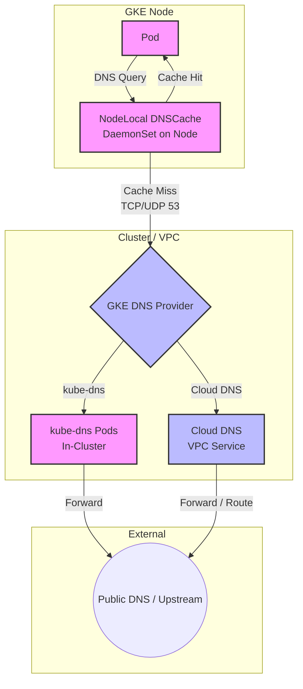

# GKE Networking Best Practices: DNS

This document outlines the best practices and design recommendations for DNS resolution in Google Kubernetes Engine (GKE).

DNS is a critical component of Kubernetes networking. DNS failures or latency directly impact application performance.

### DNS Resolution Data Flow



---

## 1. Choose the Right DNS Provider

GKE supports two main DNS providers: **kube-dns** (in-cluster) and **Cloud DNS** (managed).

### 1.1. Cloud DNS (Recommended)
*   **Recommendation**: Use **Cloud DNS** for all new clusters, especially Autopilot (where it is default) and large-scale Standard clusters.
*   **Why**:
    *   **Fully Managed**: No DNS pods to manage, scale, or monitor.
    *   **Scalability**: Handles high query volumes without bottlenecking. It scales automatically with Google Cloud infrastructure.
    *   **VPC Integration**: GKE DNS records are visible to the entire VPC, allowing VMs outside the cluster to resolve Kubernetes services easily.
    *   **Reduced Resource Usage**: Saves CPU/Memory resources on GKE nodes that would otherwise run `kube-dns` replicas.

### 1.2. Kube-DNS (In-Cluster)
*   **When to use**: Only for legacy clusters or where specific in-cluster DNS customization is required that Cloud DNS doesn't support.
*   **Best Practice**: If using `kube-dns`, you *must* monitor it and configure the `kube-dns-autoscaler` appropriately to scale with cluster size.

---

## 2. Enable NodeLocal DNSCache

*   **Recommendation**: **Always enable NodeLocal DNSCache** (available as a GKE add-on).
*   **Why**:
    *   **Latency reduction**: Runs a DNS caching agent on each node as a DaemonSet. Queries to local services or external domains are cached on the node, reducing latency.
    *   **Conntrack avoidance**: Avoids iptables DNAT rules and connection tracking (conntrack) for DNS queries, preventing "conntrack table full" errors which cause packet drops and DNS timeouts.
    *   **Reliability**: Provides a backup cache if the main DNS provider (kube-dns/Cloud DNS) is temporarily unavailable.

---

## 3. Application-Level DNS Optimizations

How applications make DNS queries can significantly impact DNS load.

### 3.1. Use Fully Qualified Domain Names (FQDNs)
*   **Recommendation**: Configure applications to use FQDNs (ending with a trailing dot, e.g., `my-service.namespace.svc.cluster.local.`) when referencing services.
*   **Why**:
    *   Kubernetes DNS configuration includes a search path (e.g., `ndots:5` by default).
    *   If a query is not an FQDN, the resolver will try to append search suffixes sequentially (e.g., `my-service.namespace.svc.cluster.local`, then `my-service.namespace.svc`, etc.) until it gets a resolution.
    *   This can result in up to 5 DNS queries (often returning NXDOMAIN) before the correct one is resolved, multiplying DNS traffic.
    *   A trailing dot tells the resolver to treat it as an absolute name and skip the search path.

### 3.2. Adjust `ndots` (with caution)
*   **Recommendation**: If you cannot use FQDNs and have high DNS load, consider lowering `ndots` in the Pod's `dnsConfig`.
*   **Example**:
    ```yaml
    apiVersion: v1
    kind: Pod
    metadata:
      name: dns-optimized-pod
    spec:
      containers:
      - name: app
        image: nginx
      dnsConfig:
        options:
        - name: ndots
          value: "1"
    ```
    *   **Warning**: Setting `ndots:1` means any name containing at least one dot will be treated as an absolute name first. This may break resolution of short internal names (e.g., calling just `my-service` instead of `my-service.namespace.svc.cluster.local`).

---

## 4. Custom DNS and Upstream Nameservers

### 4.1. Cloud DNS Scope and Upstream
*   **Recommendation**: Use Cloud DNS zones for custom internal domains.
*   **How**: If GKE needs to resolve domains hosted on-premises or in another DNS system, configure Cloud DNS forwarding zones or peered zones in the VPC. This keeps the configuration at the cloud infrastructure level rather than config files inside Kubernetes.

### 4.2. Kube-DNS Stub Domains (Legacy)
*   **How**: If still using `kube-dns`, configure stub domains and upstream nameservers via the `kube-dns` ConfigMap in the `kube-system` namespace.
    ```yaml
    apiVersion: v1
    kind: ConfigMap
    metadata:
      name: kube-dns
      namespace: kube-system
    data:
      stubDomains: |
        {"mycompany.local": ["10.240.0.10"]}
      upstreamNameservers: |
        ["8.8.8.8", "8.8.4.4"]
    ```
