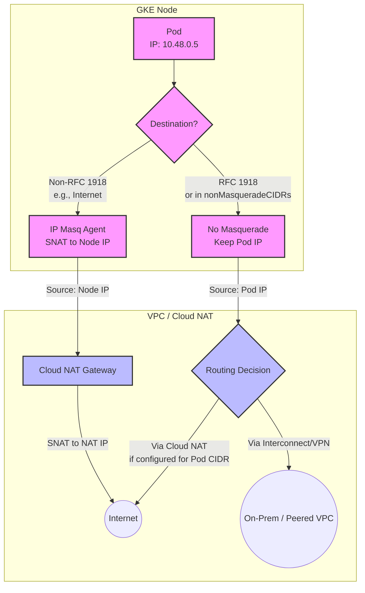

# GKE Networking Best Practices: NAT (SNAT)

This document outlines the best practices and design recommendations for NAT (specifically Source NAT / SNAT) in Google Kubernetes Engine (GKE).

NAT in GKE typically involves two components:
1.  **Cloud NAT**: Handles egress traffic from private GKE nodes to the public internet.
2.  **IP Masquerade Agent (`ip-masq-agent`)**: Handles traffic routing within the VPC and peered networks, deciding whether to translate Pod IP addresses to Node IP addresses.

### NAT Data Flow Overview



---

## 1. Cloud NAT Best Practices (Egress to Internet)

For GKE clusters in private subnets (Private GKE Clusters), Cloud NAT is the recommended way to allow Pods to access the internet.

### 1.1. Enable Dynamic Port Allocation (DPA)
*   **Recommendation**: Always use **Dynamic Port Allocation** (default in new gateways).
*   **Why**: DPA dynamically adjusts the number of source ports allocated to each node based on usage. This prevents port exhaustion on busy nodes while reclaiming unused ports from idle nodes, optimizing IP address usage.
*   **Manual Sizing (if not using DPA)**:
    *   If you must use manual allocation, start with a minimum of **64 ports per node** and scale up based on load (up to 2048).
    *   Formula for max nodes per IP: `64,512 / Min Ports per Node`. With 64 ports, one IP supports ~1000 nodes. With 1024 ports, it only supports 63 nodes.

### 1.2. Enable Private Google Access
*   **Recommendation**: Ensure **Private Google Access** is enabled on the GKE subnet.
*   **Why**: This allows Pods to reach Google APIs and services (like Artifact Registry, Cloud Storage, BigQuery) using their private IP addresses. This traffic bypasses Cloud NAT entirely, reducing Cloud NAT port usage and egress costs.

### 1.3. Restrict Cloud NAT Scope
*   **Recommendation**: Configure Cloud NAT to apply only to the GKE subnet primary and secondary ranges, rather than the entire VPC.
*   **Why**: Adheres to the principle of least privilege. Only workloads that need internet access should be routed through NAT.

### 1.4. Monitor and Alert on Port Exhaustion
*   **Recommendation**: Set up Cloud Monitoring alerts for the metric `router/nat/allocated_ports` and check for dropped packets due to resource exhaustion.
*   **Why**: Port exhaustion leads to intermittent connection timeouts in your applications.

---

## 2. IP Masquerade Agent Best Practices (Egress within VPC/Intranet)

By default, GKE uses the IP masquerade agent to perform SNAT for traffic sent to destinations outside RFC 1918 ranges. This means traffic to public IPs is masqueraded (looks like it comes from the Node IP), while traffic to internal IPs (RFC 1918) retains the Pod IP.

### 2.1. Retain Pod IP Visibility for Internal Traffic
*   **Recommendation**: Configure `nonMasqueradeCIDRs` to include all internal networks (e.g., on-premises networks, peered VPCs, other GKE clusters).
*   **Why**: Retaining the Pod IP allows for better security auditing, network policies, and troubleshooting, as the destination sees the actual Pod IP instead of the shared Node IP.

### 2.2. Customize via ConfigMap (GKE Standard)
*   **Recommendation**: Use the `ip-masq-agent` ConfigMap in the `kube-system` namespace to configure the agent. Do not modify the DaemonSet.
*   **Template ConfigMap**:
    ```yaml
    apiVersion: v1
    kind: ConfigMap
    metadata:
      name: ip-masq-agent
      namespace: kube-system
    data:
      config: |
        nonMasqueradeCIDRs:
          - 10.0.0.0/8      # Default RFC 1918
          - 172.16.0.0/12   # Default RFC 1918
          - 192.168.0.0/16  # Default RFC 1918
          - 100.64.0.0/10   # CGNAT range (if used)
          - 192.0.0.0/24    # Non-masquerade custom range (example)
        masqueradeAll: false
        resyncInterval: 60s
    ```

### 2.3. Use Egress NAT Policy (GKE Autopilot)
*   **Recommendation**: In GKE Autopilot, do not attempt to install the `ip-masq-agent` ConfigMap. Instead, use the custom resource **Egress NAT Policy**.
*   **Why**: Autopilot manages the underlying infrastructure. The `EgressNATPolicy` CRD is the supported, declarative way to configure SNAT behavior in Autopilot.
*   **Example Egress NAT Policy**:
    ```yaml
    apiVersion: networking.gke.io/v1
    kind: EgressNATPolicy
    metadata:
      name: custom-snat-policy
    spec:
      action: PredictableSNAT
      destinations:
        - cidr: 192.0.2.0/24
    ```

### 2.4. Handle Non-RFC 1918 Pod Ranges
*   **Recommendation**: If you are using non-RFC 1918 ranges for Pods (e.g., class E space or public IPs used privately), you *must* add these ranges to `nonMasqueradeCIDRs` to prevent Pod-to-Pod traffic from being masqueraded when crossing node boundaries.
